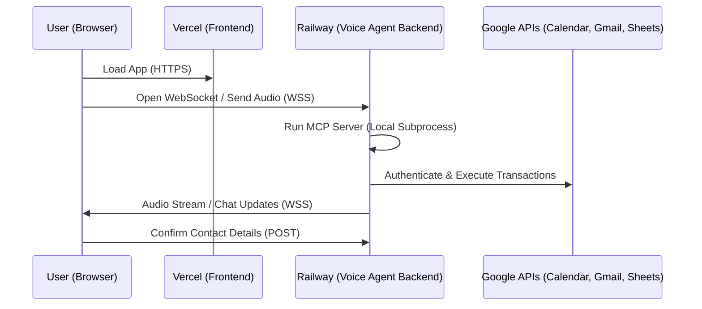

# Deployment Plan: Advisor AI Scheduler

This document outlines the step-by-step procedure to deploy the **AI Voice Agent – Advisor Appointment Scheduler** to production.

- **Frontend**: Deployed to **Vercel** (optimized for React/Vite static hosting).
* **Backend (`voice-agent` & `mcp-server`)**: Deployed to **Railway** (supporting persistent Node.js servers, WebSockets, and database volume mounts).

---

## Architecture Flow in Production



---

## 1. Backend Deployment (Railway)

The backend runs a long-lived WebSocket server. Because of this, it cannot be hosted on serverless platforms (like Vercel functions) and requires a server environment like Railway.

### Step 1.1: Database Persistence (SQLite)
By default, Railway containers have an ephemeral filesystem. If the container restarts, the SQLite database (`bookings.db`) will reset.
1. In your Railway project, click **New** -> **Volume**.
2. Mount the volume at `/app/voice-agent/data` or update the path in your code to load `bookings.db` from a persistent folder.
3. Set the environment variable `DATABASE_PATH` to point to `/data/bookings.db`.

### Step 1.2: Root Configuration (Monorepo Setup)
To deploy the backend from the subfolders, add a `Dockerfile` at the root of the project to build both the MCP Server and Voice Agent and start the service:

```dockerfile
# Use official Node.js runtime
FROM node:20-alpine

WORKDIR /app

# Copy dependency configs
COPY mcp-server/package*.json ./mcp-server/
COPY voice-agent/package*.json ./voice-agent/

# Install dependencies
RUN cd mcp-server && npm install
RUN cd voice-agent && npm install

# Copy source code
COPY mcp-server ./mcp-server
COPY voice-agent ./voice-agent

# Build MCP server (so that voice-agent can resolve ../mcp-server/dist/index.js)
RUN cd mcp-server && npm run build

# Build voice agent
RUN cd voice-agent && npm run build

# Expose port
EXPOSE 3001

# Start the voice agent backend
WORKDIR /app/voice-agent
CMD ["npm", "start"]
```

### Step 1.3: Required Environment Variables
Set the following variables in the Railway service settings:

| Variable | Description |
|---|---|
| `PORT` | `3001` (Railway automatically injects and binds this) |
| `GROQ_API_KEY` | Your Groq Cloud API credentials |
| `DEEPGRAM_API_KEY` | Your Deepgram Console API key |
| `GOOGLE_CLIENT_ID` | OAuth Client ID for Calendar/Gmail access |
| `GOOGLE_CLIENT_SECRET` | OAuth Client Secret |
| `GOOGLE_REFRESH_TOKEN` | Refresh token to generate short-lived access credentials |
| `ADVISOR_EMAIL` | Target email address to receive Gmail draft notifications |

---

## 2. Frontend Deployment (Vercel)

The frontend is a static single-page application (SPA) created with Vite.

### Step 2.1: Import to Vercel
1. Log in to [Vercel](https://vercel.com/) and click **Add New** -> **Project**.
2. Connect your Git repository.
3. Set the **Root Directory** to `frontend`.

### Step 2.2: Build Settings
Vercel should automatically detect Vite. Confirm the settings match:
* **Framework Preset**: `Vite`
* **Build Command**: `npm run build`
* **Output Directory**: `dist`

### Step 2.3: Environment Variables
Add the following key to connect the frontend to your newly deployed Railway backend:

| Key | Value | Example |
|---|---|---|
| `VITE_BACKEND_URL` | Your Railway WSS domain URL | `wss://voice-agent-production.up.railway.app` |

---

## 3. Production Verification Checklist

1. [ ] **WebSocket Handshake**: Open the deployed Vercel page and verify the WebSocket connects to Railway (`wss://.../`) without CORS or SSL errors.
2. [ ] **OAuth Refresh Token**: Verify the Google API credentials don't expire after 7 days (ensure the Google Cloud project publishing status is set to "In Production" so tokens don't expire quickly).
3. [ ] **Volume Mounts**: Trigger a test booking, restart the Railway backend, and confirm the booking still shows up in the DB viewer to ensure the SQLite persistence volume is active.
